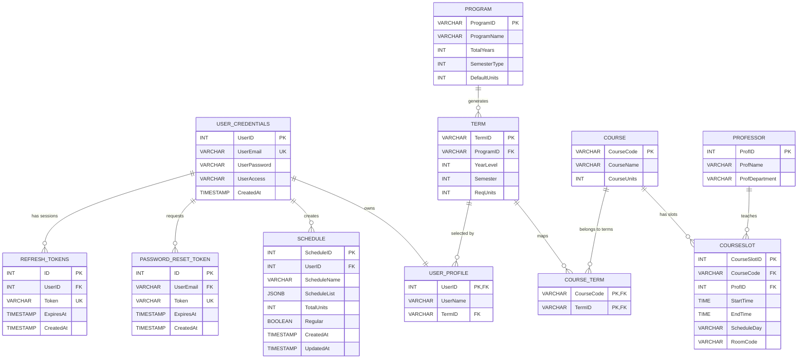

# Database Schema & SQL Architecture

This document describes the current PostgreSQL schema and the SQL access patterns used by the Academic Schedule Builder backend. The backend is now split into route and service modules under `backend/routes/` and `backend/services/`; `backend/sql/1setup.sql` remains the schema source of truth.

---

## 1. Entity Relationship Diagram



---

## 2. Table Contracts

### `USER_CREDENTIALS`

Authentication account records.

- `UserID SERIAL PRIMARY KEY`
- `UserEmail VARCHAR(255) UNIQUE NOT NULL`
- `UserPassword VARCHAR(255) NOT NULL`
- `UserAccess VARCHAR(50) DEFAULT 'Default' CHECK (UserAccess IN ('Admin', 'Default'))`
- `CreatedAt TIMESTAMP DEFAULT CURRENT_TIMESTAMP`

Passwords are stored with the current reversible AES helper in `backend/utils/crypto.js`. This is functional for the current project but should not be described as production-grade password storage.

### `USER_PROFILE`

Student display name and selected curriculum term.

- `UserID INT PRIMARY KEY REFERENCES USER_CREDENTIALS(UserID) ON DELETE CASCADE`
- `UserName VARCHAR(255) NOT NULL`
- `TermID VARCHAR(10) REFERENCES TERM(TermID) ON DELETE SET NULL`

### `PROGRAM`

Academic program configuration used to generate terms.

- `ProgramID VARCHAR(10) PRIMARY KEY`
- `ProgramName VARCHAR(255) NOT NULL`
- `TotalYears INT NOT NULL CHECK (TotalYears BETWEEN 1 AND 6)`
- `SemesterType INT NOT NULL CHECK (SemesterType IN (1, 2, 3))`
- `DefaultUnits INT NOT NULL DEFAULT 18 CHECK (DefaultUnits BETWEEN 1 AND 40)`

`backend/services/adminService.js` regenerates `TERM` rows when program duration, semester type, default units, or program ID changes.

### `TERM`

Program/year/semester blocks.

- `TermID VARCHAR(10) PRIMARY KEY`
- `ProgramID VARCHAR(10) NOT NULL REFERENCES PROGRAM(ProgramID) ON DELETE CASCADE`
- `YearLevel INT NOT NULL CHECK (YearLevel BETWEEN 1 AND 6)`
- `Semester INT NOT NULL CHECK (Semester BETWEEN 1 AND 3)`
- `ReqUnits INT`
- `UNIQUE(ProgramID, YearLevel, Semester)`

### `COURSE`

Course catalog records.

- `CourseCode VARCHAR(15) PRIMARY KEY`
- `CourseName VARCHAR(255) NOT NULL`
- `CourseUnits INT`

### `COURSE_TERM`

Many-to-many bridge between courses and terms.

- `CourseCode VARCHAR(15) REFERENCES COURSE(CourseCode) ON DELETE CASCADE`
- `TermID VARCHAR(10) REFERENCES TERM(TermID) ON DELETE CASCADE`
- `PRIMARY KEY (CourseCode, TermID)`

### `PROFESSOR`

Professor/faculty records.

- `ProfID SERIAL PRIMARY KEY`
- `ProfName VARCHAR(255) NOT NULL`
- `ProfDepartment VARCHAR(255)`

### `COURSESLOT`

Concrete scheduled class offerings.

- `CourseSlotID SERIAL PRIMARY KEY`
- `CourseCode VARCHAR(15) NOT NULL REFERENCES COURSE(CourseCode) ON DELETE CASCADE`
- `ProfID INT REFERENCES PROFESSOR(ProfID) ON DELETE SET NULL`
- `StartTime TIME NOT NULL`
- `EndTime TIME NOT NULL`
- `ScheduleDay VARCHAR(50)`
- `RoomCode VARCHAR(20)`

Create/update validation in `adminService` rejects missing times, starts before 7:00 AM, ends after 8:00 PM, and end times before or equal to start times.

### `SCHEDULE`

Saved student schedules.

- `ScheduleID SERIAL PRIMARY KEY`
- `UserID INT NOT NULL REFERENCES USER_CREDENTIALS(UserID) ON DELETE CASCADE`
- `ScheduleName VARCHAR(255) NOT NULL`
- `ScheduleList JSONB DEFAULT '[]'::jsonb`
- `TotalUnits INT DEFAULT 0`
- `Regular BOOLEAN DEFAULT TRUE`
- `CreatedAt TIMESTAMP DEFAULT CURRENT_TIMESTAMP`
- `UpdatedAt TIMESTAMP DEFAULT CURRENT_TIMESTAMP`

`ScheduleList` stores both database-backed course-slot selections and manual irregular entries. Course-slot entries contain `courseslot_id`; manual entries do not.

### `PASSWORD_RESET_TOKEN`

PIN-based password reset records.

- `ID SERIAL PRIMARY KEY`
- `UserEmail VARCHAR(255) NOT NULL REFERENCES USER_CREDENTIALS(UserEmail) ON DELETE CASCADE`
- `Token VARCHAR(255) NOT NULL UNIQUE`
- `ExpiresAt TIMESTAMP NOT NULL`
- `CreatedAt TIMESTAMP DEFAULT CURRENT_TIMESTAMP`

### `REFRESH_TOKENS`

Server-side refresh-token allowlist.

- `ID SERIAL PRIMARY KEY`
- `UserID INT NOT NULL REFERENCES USER_CREDENTIALS(UserID) ON DELETE CASCADE`
- `Token VARCHAR(500) NOT NULL UNIQUE`
- `ExpiresAt TIMESTAMP NOT NULL`
- `CreatedAt TIMESTAMP DEFAULT CURRENT_TIMESTAMP`

Login inserts a 7-day refresh token, `/api/refresh` rotates it transactionally, and `/api/logout` deletes it.

---

## 3. Indexes

`1setup.sql` adds explicit indexes for foreign-key joins and session lookups:

- `idx_term_programid`
- `idx_user_profile_termid`
- `idx_course_term_termid`
- `idx_courseslot_coursecode`
- `idx_courseslot_profid`
- `idx_schedule_userid`
- `idx_password_reset_token_useremail`
- `idx_refresh_tokens_token`
- `idx_refresh_tokens_userid`

Postgres does not automatically create indexes for foreign keys, so these are important for deletes, joins, and authenticated schedule lookups.

---

## 4. Service Query Map

### Authentication: `backend/services/authService.js`

- `signup(email, password)` inserts into `user_credentials`, then `user_profile`.
- `login(email, password)` left joins `user_profile`, verifies the encrypted password, returns a 15-minute JWT access token, and stores a 7-day refresh token.
- `refresh(refreshToken)` verifies JWT refresh claims, checks the database token row, deletes the old token, inserts a rotated token, and commits.
- `logout(refreshToken)` deletes the refresh-token row.
- `forgotPassword(email)` creates a 6-digit PIN in `password_reset_token`.
- `resetPassword(pin, email, password)` checks token/email/expiry, updates the encrypted password, and deletes the PIN.

### User Profile: `backend/services/userService.js`

- `saveTerm()` transactionally resolves `termid` from `programid`, `yearlevel`, and `semester`, then updates `user_profile`.
- `getTerm()` returns either a requested `termId` or the authenticated user's current term via `JOIN term`.
- `getSession()` left joins credentials and profile for current user metadata.
- `updateProfile()` transactionally updates email, password, and/or username after duplicate email checks.
- `deleteProfile()` deletes from `user_credentials`, relying on cascading cleanup.

### Courses and Schedules: `backend/services/courseService.js`

- `getCourses(userId)` reads the user's `termid`, then joins `course`, `course_term`, `term`, `courseslot`, and `professor`.
- `getSchedule(userId)` loads all saved schedules, extracts `courseslot_id` values from JSONB, batch-loads slot details with `ANY($1::integer[])`, then merges manual irregular entries back into the response.
- `saveSchedule()` inserts or updates `schedule` with JSON-stringified `schedule_list`.
- `removeCourseFromSchedule()` uses `jsonb_array_elements()` and `jsonb_agg()` to remove one slot entry.
- `deleteSchedule()` deletes an owned schedule row.

### Admin Catalog: `backend/services/adminService.js`

Admin routes are protected by `authenticateToken` and `adminOnly`.

- Programs are created/updated in transactions and generate terms automatically.
- Users are created/updated across `user_credentials` and `user_profile`.
- Courses are created/updated with `course_term` mappings in transactions.
- Professors and course slots are managed with parameterized CRUD.
- Course-slot writes validate time boundaries before SQL execution.
- Schedules are listed with owner email/name context and can be deleted.

### Public Programs: `backend/services/programService.js`

`GET /api/programs` uses a five-minute in-memory cache. Admin program create/update/delete calls invalidate that cache.

---

## 5. Important SQL Patterns

### Term-scoped course loading

```sql
SELECT
  c.coursecode AS course_id,
  c.coursecode AS code,
  c.coursename AS name,
  c.courseunits AS units,
  cs.courseslotid AS courseslot_id,
  t.programid AS program_id,
  t.yearlevel AS year_level,
  t.semester AS semester,
  p.profname AS teacher_name,
  p.profdepartment AS teacher_dept,
  cs.scheduleday AS schedule_day,
  cs.starttime AS start_time,
  cs.endtime AS end_time,
  cs.roomcode AS room
FROM course c
JOIN course_term ct ON c.coursecode = ct.coursecode
JOIN term t ON ct.termid = t.termid
LEFT JOIN courseslot cs ON c.coursecode = cs.coursecode
LEFT JOIN professor p ON cs.profid = p.profid
WHERE ct.termid = $1 AND cs.courseslotid IS NOT NULL
ORDER BY c.coursecode;
```

`course_term` constrains the curriculum term, while left joins keep the professor relationship optional.

### Batch schedule hydration

```sql
SELECT
  c.coursecode AS course_id,
  cs.courseslotid AS courseslot_id,
  c.coursecode AS code,
  c.coursename AS name,
  c.courseunits AS units,
  (SELECT t2.programid
   FROM course_term ct2
   JOIN term t2 ON ct2.termid = t2.termid
   WHERE ct2.coursecode = c.coursecode
   LIMIT 1) AS program_id,
  p.profname AS teacher_name,
  cs.scheduleday AS schedule_day,
  cs.starttime AS start_time,
  cs.endtime AS end_time,
  cs.roomcode AS room
FROM courseslot cs
JOIN course c ON cs.coursecode = c.coursecode
LEFT JOIN professor p ON cs.profid = p.profid
WHERE cs.courseslotid = ANY($1::integer[]);
```

The service extracts all selected slot IDs across schedules and loads them in one query to avoid N+1 calls.

### JSONB course removal

```sql
UPDATE schedule
SET schedulelist = (
  SELECT jsonb_agg(item)
  FROM jsonb_array_elements(schedulelist) item
  WHERE item->>'courseslot_id' != $1
)
WHERE scheduleid = $2 AND userid = $3
RETURNING scheduleid;
```

This updates one schedule's JSONB array in the database without fetching, mutating, and rewriting the array in application code.

### Refresh-token rotation

```sql
DELETE FROM REFRESH_TOKENS WHERE Token = $1;

INSERT INTO REFRESH_TOKENS (UserID, Token, ExpiresAt)
VALUES ($1, $2, $3);
```

The delete/insert pair runs in a transaction during `/api/refresh`, so each refresh token is single-use.

---

## 6. Referential Behavior

- Deleting a user deletes their profile, schedules, and refresh tokens.
- Deleting a program cascades to terms.
- Deleting a term cascades to `course_term` mappings and sets matching user profile terms to null.
- Deleting a course cascades to course-term mappings and course slots.
- Deleting a professor sets `courseslot.profid` to null while preserving the slot.

---

## 7. Migration Notes

There is no migration runner in the repository. Schema changes should update `backend/sql/1setup.sql`, any seed files in `backend/sql/`, affected services/routes, admin forms in `admin/admin.js`, and the relevant documentation.
