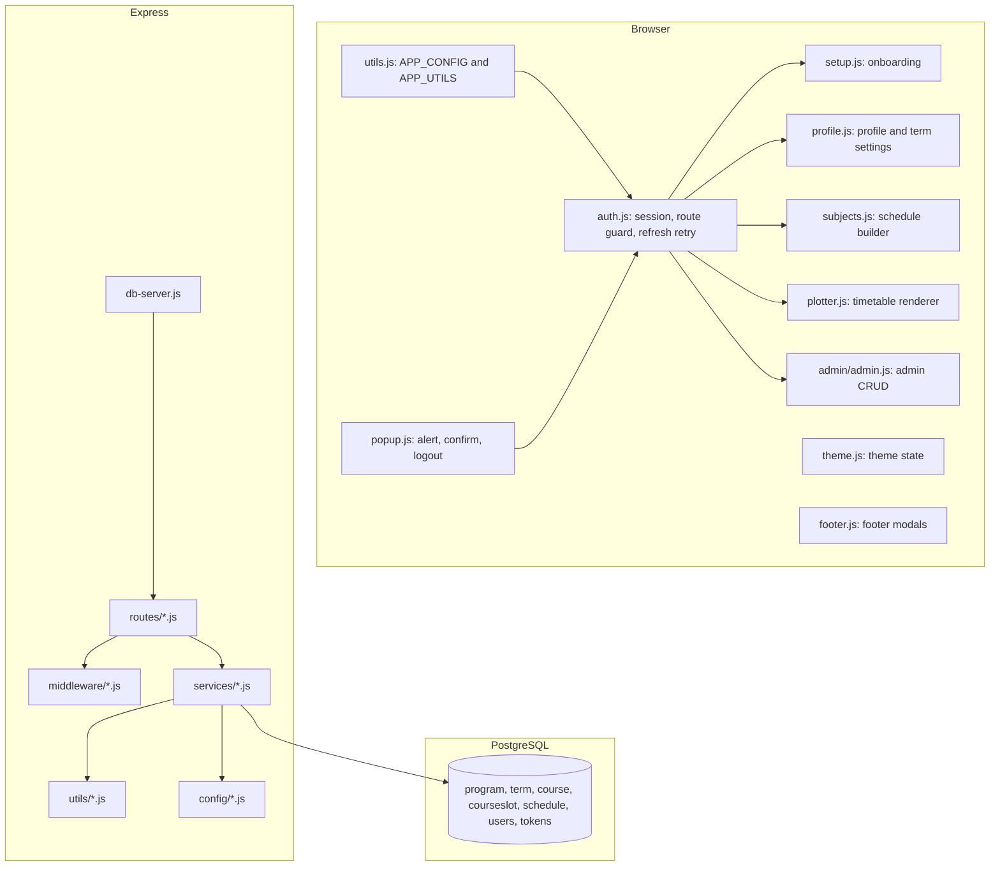

# JavaScript Architecture Reference

This document maps the current JavaScript architecture for Academic Schedule Builder. The application uses vanilla browser JavaScript on the frontend and a modular Node.js/Express backend on the server.

---

## 1. System Overview



Core rules:

- `frontend/scripts/utils.js` must load before scripts that use `APP_CONFIG` or `APP_UTILS`.
- `frontend/scripts/auth.js` owns token retrieval, route guarding, silent refresh, and auth page actions.
- Backend route files should stay thin; database logic belongs in service modules.
- Dynamic HTML should use `APP_UTILS.escapeHtml()` or `.textContent`.
- API calls use `APP_CONFIG.API_BASE`, which resolves to `http://localhost:3000/api` for local/file usage and a same-origin `/api` path for hosted deployments.

---

## 2. Backend JavaScript

### Entry Point: `backend/db-server.js`

`db-server.js` is now an Express composition root, not a monolithic route file.

Responsibilities:

- Load validated environment config through `backend/config/env.js`.
- Initialize database connectivity through `backend/config/database.js`.
- Add compression, request logging, rate limiting, CORS, JSON parsing, and optional static serving.
- Mount route groups:
  - `/api` -> `routes/auth.js`
  - `/api` -> `routes/user.js`
  - `/api` -> `routes/courses.js`
  - `/api/programs` -> `routes/programs.js`
  - `/api/admin` -> `routes/admin.js`
- Attach centralized error handling through `middleware/errorHandler.js`.
- Start the server only after `initDB()` succeeds.

### Configuration: `backend/config/`

- `env.js` loads `.env`, exports JWT/encryption/SMTP/static-serving settings, and warns about missing production secrets.
- `database.js` owns the PostgreSQL `Pool`, connection testing, and graceful shutdown hooks.

### Middleware: `backend/middleware/`

- `auth.js`
  - `authenticateToken` verifies access JWTs and sets `req.user`.
  - `adminOnly` checks `user_credentials.useraccess` before admin routes run.
- `validation.js`
  - Normalizes emails and validates simple string/email inputs.
- `errorHandler.js`
  - Provides the final Express error boundary.

### Utilities: `backend/utils/`

- `asyncHandler.js` wraps async Express handlers.
- `crypto.js` encrypts/decrypts passwords with AES-256-CBC.
- `email.js` sends password reset PINs through SMTP or writes development fallback output.
- `helpers.js` contains shared time/debug helpers such as `parseTimeToMins()`.

### Services: `backend/services/`

Service modules own SQL and business rules.

- `authService.js`
  - Signup, login, refresh-token rotation, logout, forgot-password, reset-password.
  - Access tokens expire after 15 minutes.
  - Refresh tokens expire after 7 days and are stored in `REFRESH_TOKENS`.
- `userService.js`
  - Term selection, user session payloads, profile updates, account deletion.
- `courseService.js`
  - Term-scoped course loading, saved schedule loading, schedule upsert, schedule entry removal, schedule deletion.
- `programService.js`
  - Public program list with a 5-minute in-memory cache.
- `adminService.js`
  - Admin CRUD for programs, terms, users, courses, professors, course slots, and schedules.
  - Program mutations invalidate the public program cache.
  - Course-slot writes validate 7:00 AM to 8:00 PM bounds.

---

## 3. Backend Route Map

### Auth Routes: `backend/routes/auth.js`

- `POST /api/signup`
- `POST /api/login`
- `POST /api/refresh`
- `POST /api/logout`
- `POST /api/forgot-password`
- `POST /api/reset-password`

Input validation is performed in the route. SQL and token behavior lives in `authService`.

### User Routes: `backend/routes/user.js`

- `POST /api/term`
- `GET /api/term`
- `GET /api/user-session`
- `PUT /api/user/profile`
- `DELETE /api/user/profile`

All user routes require `authenticateToken`.

### Course and Schedule Routes: `backend/routes/courses.js`

- `GET /api/courses`
- `GET /api/schedule`
- `PUT /api/schedule`
- `DELETE /api/schedule`
- `DELETE /api/schedule/:id`

All routes are user-owned and authenticated.

### Public Program Routes: `backend/routes/programs.js`

- `GET /api/programs`

This route is public so setup/profile dropdowns can load program metadata.

### Admin Routes: `backend/routes/admin.js`

`router.use(authenticateToken, adminOnly)` protects the whole admin router.

- Programs: `GET/POST/PUT/DELETE /api/admin/programs`
- Users: `GET/POST/PUT/DELETE /api/admin/users`
- User role changes: `PUT /api/admin/users/:id/make-admin`, `PUT /api/admin/users/:id/remove-admin`
- Terms: `GET/POST/PUT/DELETE /api/admin/terms`
- Courses: `GET/POST/PUT/DELETE /api/admin/courses`
- Professors: `GET/POST/PUT/DELETE /api/admin/professors`
- Course slots: `GET/POST/PUT/DELETE /api/admin/courseslots`
- Schedules: `GET /api/admin/schedules`, `DELETE /api/admin/schedules/:id`

---

## 4. Frontend Shared Layer

### `frontend/scripts/utils.js`

Exports:

- `window.APP_CONFIG.API_BASE`
- `window.APP_CONFIG.IS_LOCAL`
- `window.APP_UTILS.escapeHtml(str)`
- `window.APP_UTILS.timeStringToMinutes(timeStr)`

This file is the first frontend dependency for pages that make API calls or render dynamic server data.

### `frontend/scripts/auth.js`

Responsibilities:

- Wrap `window.fetch` to intercept `401` responses.
- Refresh access tokens via `POST /api/refresh`.
- Queue concurrent requests during refresh to avoid duplicate rotations.
- Store `token`, `refreshToken`, and `user` in `localStorage`.
- Extract `token` and `user` from query parameters for `file://` page hops.
- Redirect authenticated users away from login/signup pages.
- Inject the admin navbar button when the user has `Admin` access.
- Handle login, signup, forgot-password, and reset-password page actions.

Important details:

- Login and signup calls are excluded from fetch interception to avoid recursion.
- If refresh fails, local session data is cleared and protected pages return to login.
- `getToken()` and `redirectWithToken()` remain global compatibility helpers.

### `frontend/scripts/popup.js`

Overrides browser-style alert/confirm behavior with app modals and owns logout behavior.

Logout calls `POST /api/logout` with the stored refresh token before clearing local storage, so server-side refresh sessions are destroyed when possible.

### `frontend/scripts/theme.js`

Controls light/dark theme state through DOM attributes and persisted browser storage.

### `frontend/scripts/footer.js`

Handles footer modals and reads `versions.json` when available.

---

## 5. Student Workflow Scripts

### `frontend/scripts/setup.js`

Initial onboarding after signup/login:

- Requires an access token.
- Loads programs from `GET /api/programs`.
- Builds cascading program/year/semester selectors from `totalyears` and `semestertype`.
- Saves the selected term through `POST /api/term`.

### `frontend/scripts/profile.js`

Profile and academic settings:

- Updates username, email, and password through `PUT /api/user/profile`.
- Loads current user metadata through `GET /api/user-session`.
- Loads and updates academic term selection through `/api/programs` and `/api/term`.
- Uses token-bearing API requests and local UI state for editable fields.

### `frontend/scripts/classes.js`

Lightweight constructors for:

- `Professor`
- `CourseSlot`
- `Course`

These are used by schedule-facing scripts as data-shaping helpers.

### `frontend/scripts/subjects.js`

The schedule builder workspace:

- Loads term data and required units.
- Loads available courses through `GET /api/courses`.
- Maintains selected database-backed courses and manual irregular entries.
- Detects conflicts with `doTimesOverlap()` and `checkScheduleConflict()`.
- Computes `REGULAR` only when total units match required units and there are no irregular manual entries.
- Saves schedules through `PUT /api/schedule`.
- Loads/switches/deletes saved schedules through `GET /api/schedule` and `DELETE /api/schedule/:id`.

Schedule payloads must remain compatible with `courseService.saveSchedule()`:

```json
{
  "schedule_id": 1,
  "schedule_name": "My Schedule",
  "total_units": 18,
  "regular": true,
  "schedule_list": []
}
```

### `frontend/scripts/plotter.js`

The timetable visualization layer:

- Loads saved schedules through `GET /api/schedule`.
- Renders Monday-Saturday columns from 7:00 AM to 8:00 PM.
- Converts time strings into minute offsets through `APP_UTILS.timeStringToMinutes()`.
- Distinguishes manual irregular entries from database-backed course-slot entries.
- Renders block text with `.textContent`.
- Exports the timetable using `html2canvas`.

---

## 6. Admin Dashboard Script

### `admin/admin.js`

Admin dashboard responsibilities:

- Verifies current user session and admin access.
- Loads tab data from `/api/admin/:tab`.
- Keeps global dependency caches for programs, terms, courses, and professors.
- Renders tables for users, programs, terms, courses, professors, course slots, and schedules.
- Opens create/edit modals with context-sensitive fields.
- Supports program -> term -> course filtering flows.
- Validates course-slot time ranges before submission.
- Calls role endpoints for make-admin/remove-admin.
- Calls delete endpoints and refreshes affected caches.

The script relies on `APP_CONFIG.API_BASE`, `APP_UTILS.timeStringToMinutes()`, and token helpers from `auth.js`.

---

## 7. Cross-Cutting Patterns

### API calls

Use:

```javascript
fetch(`${API_BASE}/path`, {
  headers: { Authorization: `Bearer ${token}` }
});
```

Authenticated frontend scripts should rely on `getToken()` instead of re-implementing token discovery.

### Time handling

Frontend time comparisons use integer minutes. Backend course-slot writes also validate times through `parseTimeToMins()`. Keep both sides aligned when changing timetable bounds.

### Dynamic HTML

Preferred rendering:

- `.textContent` for plain text.
- `APP_UTILS.escapeHtml()` before `innerHTML`.

### Error handling

Routes use `asyncHandler`, but many route files also catch service errors to return specific status codes and messages. Preserve nearby style when editing a route.

### Generated analysis

`graphify-out/` is generated analysis output. It can guide architecture work, but application behavior is determined by files under `backend/`, `frontend/`, `admin/`, `pages/`, `public/`, and `k8s/`.

---

## 8. Known Technical Debt

- Password storage is reversible AES rather than bcrypt/argon2.
- Frontend scripts are global and order-sensitive.
- Several pages still use inline event attributes.
- Admin dashboard is large and could eventually be split into API, rendering, filters, and modal modules.
- There is no automated test suite documented.
- GitHub Pages deployment still requires a real hosted backend URL in `APP_CONFIG`.
